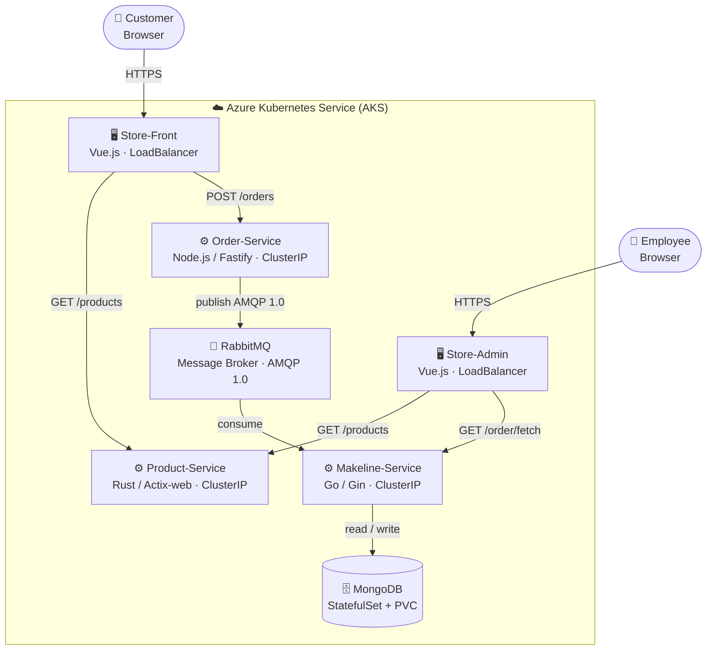

# Best Buy Store — Cloud-Native Microservices Application

> **CST8915 Final Project** — A cloud-native, microservices-based e-commerce application deployed on Azure Kubernetes Service (AKS).
 **Usama Iqbal 040777763 - Winter 2026**

---

## Architecture Diagram



The application is composed of **5 microservices** and a **MongoDB database**, all running inside an AKS cluster:

| Component | Role | Technology |
|---|---|---|
| **Store-Front** | Customer-facing web app | Vue.js (LoadBalancer) |
| **Store-Admin** | Employee management dashboard | Vue.js (LoadBalancer) |
| **Order-Service** | Accepts and queues customer orders | Node.js / Fastify |
| **Product-Service** | Serves the product catalogue | Rust / Actix-web |
| **Makeline-Service** | Consumes orders from queue and saves to DB | Go / Gin |
| **MongoDB** | Persistent order database | MongoDB 6.0 (StatefulSet) |
| **RabbitMQ** | Message broker between Order and Makeline | RabbitMQ 3.13 (AMQP 1.0) |

---

## Application Overview

Best Buy Store is a cloud-native demo application that simulates a real e-commerce storefront. Customers can browse electronics products, add items to a cart, and place orders through **Store-Front**. Orders are published to a **RabbitMQ** message queue by the **Order-Service**, consumed asynchronously by the **Makeline-Service**, and persisted to **MongoDB**. Employees can view and process pending orders through **Store-Admin**.

Key design principles:
- **Microservices architecture** — each service owns a single responsibility and can be deployed independently
- **Asynchronous order processing** — RabbitMQ decouples order intake from processing, ensuring no orders are lost during traffic spikes
- **Stateful database** — MongoDB is deployed as a Kubernetes StatefulSet with a PersistentVolumeClaim to survive pod restarts
- **ConfigMaps and Secrets** — all configuration and credentials are injected at runtime, keeping sensitive values out of source code
- **CI/CD pipelines** — GitHub Actions automates building, pushing, and deploying each service on every commit

---

## Deployment Instructions

### Prerequisites

- [Azure CLI](https://learn.microsoft.com/en-us/cli/azure/install-azure-cli) installed and logged in
- [kubectl](https://kubernetes.io/docs/tasks/tools/) installed
- An AKS cluster created and kubeconfig configured

### 1. Connect to your AKS cluster

```bash
az aks get-credentials --resource-group <your-resource-group> --name <your-aks-cluster-name>
```

### 2. Verify connection

```bash
kubectl get nodes
```

All nodes should show `Ready`.

### 3. Deploy all services

```bash
kubectl apply -f "Deployment Files/aps-all-in-one.yaml"
```

This single command creates the namespace, ConfigMap, Secret, all Deployments/StatefulSets, and all Services.

### 4. Wait for pods to start

```bash
kubectl get pods -n bestbuy-store --watch
```

All 7 pods should reach `Running` status within 2–3 minutes.

### 5. Get the public IP addresses

```bash
kubectl get services -n bestbuy-store
```

Look for the `EXTERNAL-IP` column on the `store-front` and `store-admin` services.

| Service | URL |
|---|---|
| Store-Front (customers) | `http://http://4.236.53.191/` |
| Store-Admin (employees) | `http://4.249.113.92/` |

### 6. Verify the application

1. Open Store-Front in a browser and browse the product catalogue
2. Add a product to the cart and place an order
3. Open Store-Admin and confirm the order appears

---

## Stopping and Starting the Cluster (Cost Saving)

To stop the cluster when not in use:

```bash
az aks stop --resource-group <your-resource-group> --name <your-aks-cluster-name>
```

To start it again:

```bash
az aks start --resource-group <your-resource-group> --name <your-aks-cluster-name>
```

Wait ~2 minutes after starting, then verify all pods are Running:

```bash
kubectl get pods -n bestbuy-store
```

---

## CI/CD Pipeline

Each microservice repository contains a GitHub Actions workflow (`.github/workflows/`) that:

1. Triggers on every push to `main`
2. Builds a Docker image tagged with the commit SHA
3. Pushes the image to Docker Hub
4. Authenticates to AKS using a kubeconfig secret
5. Performs a rolling deployment with `kubectl set image`

**GitHub Secrets required in each repo:**

| Secret | Value |
|---|---|
| `DOCKERHUB_USERNAME` | Docker Hub username - not posted intentionally |
| `DOCKERHUB_TOKEN` | Your Docker Hub access token - not posted intentionally |
| `KUBE_CONFIG` | Base64 output of your kubeconfig file - not posted intentionally|

---

## Repository & Image Links

### GitHub Repositories

| Service | Repository |
|---|---|
| Store-Front | [github.com/uiqbal12/store-front](https://github.com/uiqbal12/store-front-L8) |
| Store-Admin | [github.com/uiqbal12/store-admin](https://github.com/uiqbal12/store-admin-L8) |
| Order-Service | [github.com/uiqbal12/order-service](https://github.com/uiqbal12/order-service-L8) |
| Makeline-Service | [github.com/uiqbal12/makeline-service](https://github.com/uiqbal12/makeline-service-L8) |
| Product-Service | [github.com/uiqbal12/product-service](https://github.com/uiqbal12/product-service-L8) |

### Docker Hub Images

| Service | Image |
|---|---|
| Store-Front | [hub.docker.com/r/usamaiqbal25/store-front](https://hub.docker.com/r/usamaiqbal25/store-front) |
| Store-Admin | [hub.docker.com/r/usamaiqbal25/store-admin](https://hub.docker.com/r/usamaiqbal25/store-admin) |
| Order-Service | [hub.docker.com/r/usamaiqbal25/order-service](https://hub.docker.com/r/usamaiqbal25/order-service) |
| Makeline-Service | [hub.docker.com/r/usamaiqbal25/makeline-service](https://hub.docker.com/r/usamaiqbal25/makeline-service) |
| Product-Service | [hub.docker.com/r/usamaiqbal25/product-service](https://hub.docker.com/r/usamaiqbal25/product-service) |

---

## Demo Video

> 📹 [Watch the demo on YouTube](#) ← *Replace with your YouTube link*

The video covers:
1. **Architecture walkthrough** — design decisions and component overview
2. **Live application demo** — browsing products, placing orders, viewing in Store-Admin
3. **CI/CD demonstration** — live pipeline run triggered by a code push